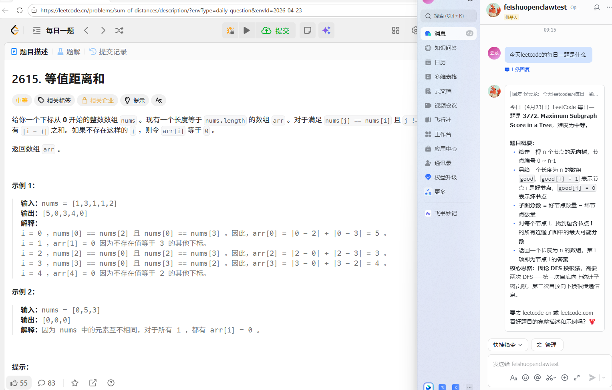
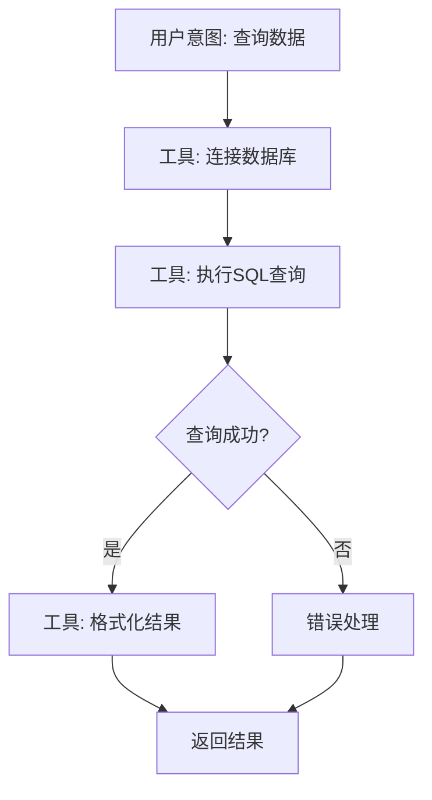

# 飞书 OpenClaw Memory2Skills 插件



## 快速安装

```bash
# 安装依赖
npm install
# 类型检查
npx tsc --noEmit
# 打包为 tgz
npm pack
# 列出已安装插件
openclaw plugins list
# 安装本地插件（目录或 tgz 均可）
openclaw plugins install ./myorg-openclaw-mem2skill-1.0.0.tgz
# 重启 Gateway 网关
openclaw gateway restart
```

## 特性概览

- **智能记忆提取**: 自动从对话中提取关键信息，构建结构化事件链
- **技能自动生成**: 多次成功执行后，自动总结通用解决方案
- **三级记忆体系**: Short Memory → Long Memory → Fixed Memory 逐级进化
- **语义检索**: 基于向量数据库的混合检索，支持语义相似度匹配
- **知识图谱**: 支持意图-动作-结果的关系查询和路径分析

## 目录

- [插件功能描述](#插件功能描述)
- [核心功能](#核心功能)
  - [记忆提取/建图](#1-记忆提取建图)
  - [Query检索](#2-query检索)
  - [相似事件链合并](#3-相似事件链合并)
  - [技能生成/迭代](#4-技能生成迭代)
- [Pro 功能](#pro-功能)
- [评价指标](#评价指标)
- [技术栈选型](#技术栈选型)
- [实现路线图](#实现路线图)
- [开发建议](#开发建议)
- [参考资料](#参考资料)

---

## 插件功能描述

每次任务结束后,插件会自动提取对话中的关键信息(如用户需求、上下文、重要事件等),并将这些信息以知识图谱的形式存储.
当该任务成功后(打分or评价-),插件将信息保存、生成摘要等信息,并存储在向量数据库中.
多次相同的任务成功后,插件会自动总结出一个通用的解决方案,并将其存储在 Short Memory 中.
并在之后的任务中,不断的使用,更新该技能的内容,形成一个不断迭代的技能.
当成功率高于阈值时,插件会将该技能自动升级为 Long Memory,并在插件中形成一个显式的技能,供 AI 调用.
用户可以通过将阅读显示技能,来确认是否需要将该技能升级为 Fixed Memory.

打分人为打分 or 根据用户反馈对前一个任务进行评价：
- 0分: 完全失败
- 1-9分: 部分成功
- 10分: 完全成功
- 量化到(0-1)之间,记录在事件链中

## 插件框架/架构图

文件框架
```
feishu-memory/
|-- package.json              # npm 元信息 + openclaw 配置
|-- openclaw.plugin.json      # 插件清单
|-- index.ts                  # 入口文件 (definePluginEntry)
|-- api.ts                    # 公共类型导出
|-- src/
|   |-- storage.ts            # 存储层实现(向量数据库/JSON Lines)
|   |-- processor.ts          # 记忆处理逻辑(提取、压缩、召回)
|   |-- adapter.ts            # 飞书上下文适配器
|   |-- pro-features.ts       # Pro 功能实现
|   `-- types.ts              # 类型定义
|-- skills/
|   `-- memory-management.md  # 给 AI 看的技能说明
|-- pic/                      # 图片资源
`-- arch.md                   # 架构文档
```


架构图如下:
```
┌─────────────────────────────────────────────────────────────────┐
│                        飞书对话界面                              │
└────────────────────────┬────────────────────────────────────────┘
                         │
                         ▼
┌─────────────────────────────────────────────────────────────────┐
│                    OpenClaw Plugin Entry                         │
│  ┌──────────────┐  ┌──────────────┐  ┌──────────────┐          │
│  │ onTaskStart  │  │ onTaskEnd    │  │ onFeedback   │          │
│  └──────┬───────┘  └──────┬───────┘  └──────┬───────┘          │
└─────────┼──────────────────┼──────────────────┼─────────────────┘
          │                  │                  │
          ▼                  ▼                  ▼
┌─────────────────────────────────────────────────────────────────┐
│                      Adapter Layer                               │
│  ┌────────────────────────────────────────────────────────────┐ │
│  │  extractConversation() - 提取对话上下文                     │ │
│  │  extractToolCalls() - 提取工具调用序列                      │ │
│  │  extractUserIntent() - 提取用户意图                         │ │
│  └────────────────────────────────────────────────────────────┘ │
└────────────────────────┬────────────────────────────────────────┘
                         │
                         ▼
┌─────────────────────────────────────────────────────────────────┐
│                    Processor Layer                               │
│  ┌──────────────────┐  ┌──────────────────┐                     │
│  │ Memory Extractor │  │ Skill Generator  │                     │
│  │  - 事件链构建    │  │  - 模式识别      │                     │
│  │  - 知识图谱建模  │  │  - 技能模板生成  │                     │
│  │  - 向量化        │  │  - 成功率统计    │                     │
│  └────────┬─────────┘  └────────┬─────────┘                     │
└───────────┼──────────────────────┼─────────────────────────────┘
            │                      │
            ▼                      ▼
┌─────────────────────────────────────────────────────────────────┐
│                      Storage Layer                               │
│  ┌──────────────┐  ┌──────────────┐  ┌──────────────┐          │
│  │ Vector DB    │  │ Graph DB     │  │ Skill Store  │          │
│  │ (事件向量)   │  │ (事件链图)   │  │ (技能库)     │          │
│  │              │  │              │  │ - Short Mem  │          │
│  │ - 语义检索   │  │ - 关系查询   │  │ - Long Mem   │          │
│  │ - 相似度计算 │  │ - 路径分析   │  │ - Fixed Mem(外部)  │          │
│  └──────────────┘  └──────────────┘  └──────────────┘          │
└─────────────────────────────────────────────────────────────────┘
```

### Architecture

## 快速开始

### 环境要求

- **Node.js**: >= 18.0.0
- **OpenClaw**: >= v2026.4.11
- **Plugin API**: >= 2026.3.24-beta.2

### 安装步骤

1. **克隆项目**
   ```bash
   git clone <repository-url>
   cd openclaw-mem2skill
   ```

2. **安装依赖**
   ```bash
   npm install
   ```

3. **配置插件**
   编辑 `openclaw.plugin.json`:
   ```json
   {
     "id": "mem2skill",
     "name": "Memory2Skills",
     "description": "从对话记忆中自动生成技能",
     "configSchema": {
       "type": "object",
       "properties": {
         "successThreshold": {
           "type": "number",
           "default": 0.8
         },
         "shortMemoryThreshold": {
           "type": "number",
           "default": 3
         }
       }
     }
   }
   ```

4. **运行插件**
   ```bash
   npx openclaw dev
   ```

### 验证安装

插件启动后，可通过以下方式验证：
- 检查 OpenClaw 日志中是否有 "Memory2Skills plugin loaded" 信息
- 在飞书对话中触发任务，观察控制台是否有记忆提取日志


## 核心功能

### 1. 记忆提取/建图

将问题、工具调用、回答、交互等操作提取成结构化的事件链,并存储在知识图谱中.

**实现细节:**

#### 事件链结构
```typescript
interface EventChain {
  id: string;
  taskId: string;
  timestamp: number;
  userIntent: string;           // 用户意图摘要
  events: Event[];              // 事件序列
  toolSequence: string[];      // 工具调用序列 (仅问题+工具链调用+反馈结果)
  outcome: 'success' | 'failure' | 'partial';
  feedback?: UserFeedback;      // 用户反馈
  embedding: number[];          // 整体向量表示
}

interface Event {
  type: 'user_query' | 'tool_call' | 'ai_response' | 'error';
  content: string;
  metadata: {
    toolName?: string;
    parameters?: any;
    result?: any;
    timestamp: number;
  };
}
```

#### 知识图谱节点类型
- **Intent Node**: 用户意图节点 (如 "查询数据库", "生成报告")
- **Action Node**: 工具调用节点 (如 "执行SQL", "读取文件")
- **Context Node**: 上下文信息节点 (如 "数据库连接", "文件路径")
- **Outcome Node**: 结果节点 (成功/失败/部分成功)

#### 关系类型
- `TRIGGERS`: Intent → Action (意图触发动作)
- `REQUIRES`: Action → Context (动作需要上下文)
- `LEADS_TO`: Action → Action (动作序列)
- `RESULTS_IN`: Action → Outcome (动作产生结果)

#### 提取流程
1. **对话解析**: 从飞书对话中提取消息序列
2. **意图识别**: 使用 LLM 提取用户核心意图
3. **工具链提取**: 记录所有工具调用及其参数/结果
4. **向量化**: 使用 embedding 模型生成语义向量(仅问题+工具链调用+反馈结果)
5. **图谱构建**: 创建节点和边，存入图数据库

### 2. Query检索

根据问题找到相关的事件链

**实现细节:**

#### 检索策略
```typescript
interface RetrievalStrategy {
  // 1. 向量相似度检索
  vectorSearch(query: string, topK: number): EventChain[];
  
  // 2. 图谱路径检索
  graphSearch(intentNode: string): EventChain[];
  
  // 3. 混合检索 (向量 + 图谱)
  hybridSearch(query: string, topK: number): EventChain[];
}
```

#### 检索流程
1. **查询向量化**: 将用户新问题转换为向量
2. **粗排**: 向量数据库返回 top-50 相似事件链
3. **精排**: 
   - 计算意图相似度 (0.4权重)
   - 计算工具序列相似度 (0.3权重)
   - 考虑历史成功率 (0.2权重)
   - 考虑时间衰减 (0.1权重)
4. **返回**: top-5 最相关事件链

#### 相似度计算
```typescript
function calculateSimilarity(query: EventChain, candidate: EventChain): number {
  const intentSim = cosineSimilarity(query.embedding, candidate.embedding);
  const toolSim = jaccard(query.toolSequence, candidate.toolSequence);
  const successRate = candidate.successCount / candidate.totalCount;
  const timeFactor = Math.exp(-0.1 * daysSince(candidate.lastUsed));
  
  return 0.4 * intentSim + 0.3 * toolSim + 0.2 * successRate + 0.1 * timeFactor;
}
```

### 3. 相似事件链合并

**实现细节:**

#### 合并条件
- 意图相似度 > 0.85
- 工具调用序列相似度 > 0.75
- 上下文重叠度 > 0.6

#### 合并策略
```typescript
interface MergeStrategy {
  // 提取共同模式
  extractCommonPattern(chains: EventChain[]): Pattern;
  
  // 识别变化部分
  identifyVariables(chains: EventChain[]): Variable[];
  
  // 生成抽象模板
  generateTemplate(pattern: Pattern, variables: Variable[]): SkillTemplate;
}
```

#### 合并流程
1. **聚类**: 使用 DBSCAN 对事件链进行聚类
2. **模式提取**: 
   - 找出固定的工具调用序列
   - 识别可变参数位置
   - 提取前置条件和后置条件
3. **模板生成**: 创建参数化的技能模板
4. **验证**: 用历史数据验证模板准确性

### 4. 技能生成/迭代

**实现细节:**

#### 技能生命周期
```
新事件链 → Short Memory (3次成功) → Long Memory (成功率>80%) → Fixed Memory (人工确认)
```

#### 技能结构
```typescript
interface Skill {
  id: string;
  name: string;
  description: string;
  level: 'short' | 'long' | 'fixed';
  
  // 技能模板
  template: {
    intent: string;              // 适用意图
    preconditions: string[];     // 前置条件
    steps: SkillStep[];          // 执行步骤
    postconditions: string[];    // 后置条件
  };
  
  // 统计信息
  stats: {
    totalUses: number;
    successCount: number;
    failureCount: number;
    successRate: number;
    avgExecutionTime: number;
    lastUsed: number;
  };
  
  // 关联的事件链
  sourceChains: string[];
}

interface SkillStep {
  action: string;               // 工具名称
  parameters: ParameterTemplate[];
  errorHandling?: string;
}
```

#### 技能升级规则
```typescript
// Short → Long
if (skill.stats.successCount >= 3 && skill.stats.successRate > 0.8) {
  upgradeToLongMemory(skill);
}

// Long → Fixed
if (skill.stats.totalUses >= 10 && skill.stats.successRate > 0.9) {
  suggestFixedMemory(skill); // 需要人工确认
}
```

#### 技能迭代
1. **使用反馈**: 每次使用后更新统计信息
2. **失败分析**: 失败时记录失败原因，调整模板
3. **参数优化**: 根据成功案例优化参数范围
4. **步骤精简**: 移除冗余步骤，优化执行路径

## Pro 功能

### 1. 用户问题 → Prompt 标准化

**目标**: 将用户的自然语言问题转换为结构化的标准 Prompt，提高检索准确性

**实现细节:**

#### 标准化流程
```typescript
interface PromptNormalizer {
  // 1. 意图分类
  classifyIntent(userQuery: string): IntentCategory;
  
  // 2. 实体提取
  extractEntities(userQuery: string): Entity[];
  
  // 3. 参数规范化
  normalizeParameters(entities: Entity[]): NormalizedParams;
  
  // 4. 生成标准 Prompt
  generateStandardPrompt(intent: IntentCategory, params: NormalizedParams): string;
}
```

#### 意图分类体系
```typescript
enum IntentCategory {
  DATA_QUERY = 'data_query',           // 数据查询
  FILE_OPERATION = 'file_operation',   // 文件操作
  CODE_GENERATION = 'code_generation', // 代码生成
  DEBUGGING = 'debugging',             // 调试问题
  DEPLOYMENT = 'deployment',           // 部署相关
  ANALYSIS = 'analysis',               // 数据分析
  // ... 更多分类
}
```

#### 示例转换
```
用户输入: "帮我看看昨天的销售数据"
标准化后: {
  intent: "DATA_QUERY",
  entities: {
    dataType: "sales",
    timeRange: "2026-04-21",
    action: "retrieve_and_display"
  },
  standardPrompt: "查询销售数据，时间范围：2026-04-21"
}
```

### 2. 事件链可视化

**目标**: 以图形化方式展示事件链，帮助理解任务执行流程

**实现细节:**

#### 可视化组件
```typescript
interface EventChainVisualizer {
  // 生成 Mermaid 流程图
  toMermaid(chain: EventChain): string;
  
  // 生成交互式 D3.js 图
  toD3Graph(chain: EventChain): D3GraphData;
  
  // 生成时间线视图
  toTimeline(chain: EventChain): TimelineData;
}
```

#### Mermaid 示例输出


#### 可视化维度
- **时间维度**: 显示每个步骤的执行时间
- **依赖关系**: 显示工具调用的依赖链
- **成功/失败**: 用颜色标识每个步骤的状态
- **参数流**: 显示参数在步骤间的传递

### 3. 记忆总结/压缩

**目标**: 定期压缩历史记忆，保持存储效率和检索速度

**实现细节:**

#### 压缩策略
```typescript
interface MemoryCompressor {
  // 1. 时间衰减压缩
  timeBasedCompression(cutoffDays: number): void;
  
  // 2. 相似度合并
  similarityBasedMerge(threshold: number): void;
  
  // 3. 重要性保留
  importanceBasedRetention(topK: number): void;
}
```

#### 压缩规则
```typescript
const compressionRules = {
  // 30天前的失败事件链 → 删除
  oldFailures: {
    condition: (chain) => chain.outcome === 'failure' && daysSince(chain) > 30,
    action: 'delete'
  },
  
  // 90天前的低频成功事件链 → 归档
  lowFrequencyOld: {
    condition: (chain) => chain.stats.totalUses < 3 && daysSince(chain) > 90,
    action: 'archive'
  },
  
  // 相似度 > 0.95 的事件链 → 合并
  highSimilarity: {
    condition: (chain1, chain2) => similarity(chain1, chain2) > 0.95,
    action: 'merge'
  }
};
```

#### 压缩流程
1. **标记阶段**: 扫描所有事件链，标记待压缩项
2. **合并阶段**: 合并高度相似的事件链
3. **归档阶段**: 将低频事件链移至冷存储
4. **删除阶段**: 删除过期失败记录
5. **重建索引**: 更新向量索引和图谱

### 4. 成功/失败记录索引

**目标**: 快速定位成功和失败案例，用于技能优化和问题诊断

**实现细节:**

#### 索引结构
```typescript
interface OutcomeIndex {
  // 成功案例索引
  successIndex: {
    byIntent: Map<string, EventChain[]>;      // 按意图索引
    byToolChain: Map<string, EventChain[]>;   // 按工具链索引
    bySuccessRate: EventChain[];              // 按成功率排序
  };
  
  // 失败案例索引
  failureIndex: {
    byErrorType: Map<string, EventChain[]>;   // 按错误类型索引
    byFailurePattern: Map<string, EventChain[]>; // 按失败模式索引
    recentFailures: EventChain[];             // 最近失败
  };
}
```

#### 失败模式识别
```typescript
interface FailurePattern {
  pattern: string;                    // 失败模式描述
  frequency: number;                  // 出现频率
  affectedIntents: string[];          // 影响的意图类型
  commonCause: string;                // 常见原因
  suggestedFix: string;               // 建议修复方案
}

// 示例失败模式
const examplePattern: FailurePattern = {
  pattern: "数据库连接超时",
  frequency: 15,
  affectedIntents: ["DATA_QUERY", "DATA_UPDATE"],
  commonCause: "数据库连接池耗尽",
  suggestedFix: "增加连接池大小或添加重试机制"
};
```

### 5. 记忆升级/降级

**目标**: 动态调整技能的记忆级别，优化存储和性能

**实现细节:**

#### 升级/降级规则
```typescript
interface MemoryLevelManager {
  // 升级规则
  upgradeRules: {
    shortToLong: {
      minSuccessCount: 3,
      minSuccessRate: 0.8,
      minUseFrequency: 0.5  // 每周至少使用0.5次
    },
    longToFixed: {
      minSuccessCount: 10,
      minSuccessRate: 0.9,
      requiresHumanApproval: true
    }
  };
  
  // 降级规则
  downgradeRules: {
    fixedToLong: {
      maxFailureRate: 0.3,    // 失败率超过30%
      inactivityDays: 90      // 90天未使用
    },
    longToShort: {
      maxFailureRate: 0.5,
      inactivityDays: 60
    },
    shortToArchive: {
      maxFailureRate: 0.7,
      inactivityDays: 30
    }
  };
}
```

#### 自动评估流程
```typescript
async function evaluateMemoryLevels() {
  const allSkills = await skillStore.getAllSkills();
  
  for (const skill of allSkills) {
    const metrics = calculateMetrics(skill);
    
    // 检查升级条件
    if (shouldUpgrade(skill, metrics)) {
      await upgradeSkill(skill);
      notifyUser(`技能 "${skill.name}" 已升级到 ${skill.level}`);
    }
    
    // 检查降级条件
    if (shouldDowngrade(skill, metrics)) {
      await downgradeSkill(skill);
      notifyUser(`技能 "${skill.name}" 已降级到 ${skill.level}`);
    }
  }
}

// 每天运行一次评估
schedule.daily('02:00', evaluateMemoryLevels);
```

#### 人工审核界面
```typescript
interface SkillReviewUI {
  // 待审核技能列表
  pendingReviews: Skill[];
  
  // 审核操作
  approve(skillId: string): void;      // 批准升级
  reject(skillId: string): void;       // 拒绝升级
  modify(skillId: string, changes: Partial<Skill>): void; // 修改后批准
  
  // 展示信息
  showStats(skill: Skill): SkillStats;
  showExamples(skill: Skill): EventChain[];
  showComparison(skill: Skill): ComparisonData;
}
``` 


### 6. 失败原因分析

**目标**: 自动分析任务失败的根本原因，为技能优化提供依据

**实现细节:**

#### 失败分类体系
```typescript
enum FailureCategory {
  TOOL_ERROR = 'tool_error',           // 工具调用失败
  PARAMETER_ERROR = 'parameter_error', // 参数错误
  LOGIC_ERROR = 'logic_error',         // 逻辑错误
  TIMEOUT = 'timeout',                 // 超时
  PERMISSION_DENIED = 'permission_denied', // 权限不足
  RESOURCE_UNAVAILABLE = 'resource_unavailable', // 资源不可用
  UNEXPECTED_OUTPUT = 'unexpected_output' // 输出不符合预期
}

interface FailureAnalysis {
  chainId: string;
  category: FailureCategory;
  rootCause: string;              // 根本原因描述
  failedStep: number;             // 失败的步骤索引
  errorMessage: string;           // 错误信息
  suggestedFix: string;           // 建议修复方案
  relatedFailures: string[];      // 相关失败案例ID
}
```

#### 分析流程
1. **错误捕获**: 记录失败时的完整上下文
2. **模式匹配**: 与已知失败模式进行匹配
3. **根因分析**: 使用 LLM 分析失败的根本原因
4. **修复建议**: 生成可操作的修复建议
5. **知识积累**: 将新的失败模式加入知识库

#### 自动修复策略
```typescript
interface AutoFixStrategy {
  // 参数调整
  adjustParameters(failedChain: EventChain): EventChain;
  
  // 重试机制
  retryWithBackoff(failedChain: EventChain, maxRetries: number): Promise<EventChain>;
  
  // 降级方案
  fallbackStrategy(failedChain: EventChain): EventChain;
}
```

### 7. 技能组合 (最小技能单元)

**目标**: 支持技能之间的组合调用，构建复杂的工作流

**实现细节:**

#### 技能组合模式
```typescript
interface CompositeSkill {
  id: string;
  name: string;
  description: string;
  subSkills: SkillReference[];     // 子技能引用
  compositionType: 'sequential' | 'parallel' | 'conditional';
}

interface SkillReference {
  skillId: string;
  inputMapping: Record<string, string>;  // 输入参数映射
  outputMapping: Record<string, string>; // 输出参数映射
  condition?: string;                    // 执行条件 (可选)
}
```

#### 组合类型

**1. 顺序组合 (Sequential)**
```typescript
// 示例: 数据分析工作流
const dataAnalysisWorkflow: CompositeSkill = {
  id: 'data-analysis-workflow',
  name: '数据分析工作流',
  compositionType: 'sequential',
  subSkills: [
    { skillId: 'fetch-data', outputMapping: { data: 'rawData' } },
    { skillId: 'clean-data', inputMapping: { input: 'rawData' }, outputMapping: { cleaned: 'cleanData' } },
    { skillId: 'analyze-data', inputMapping: { data: 'cleanData' }, outputMapping: { result: 'analysis' } },
    { skillId: 'generate-report', inputMapping: { analysis: 'analysis' } }
  ]
};
```

**2. 并行组合 (Parallel)**
```typescript
// 示例: 多源数据获取
const multiSourceFetch: CompositeSkill = {
  id: 'multi-source-fetch',
  name: '多源数据获取',
  compositionType: 'parallel',
  subSkills: [
    { skillId: 'fetch-from-db', outputMapping: { data: 'dbData' } },
    { skillId: 'fetch-from-api', outputMapping: { data: 'apiData' } },
    { skillId: 'fetch-from-file', outputMapping: { data: 'fileData' } }
  ]
};
```

**3. 条件组合 (Conditional)**
```typescript
// 示例: 智能数据处理
const smartDataProcessing: CompositeSkill = {
  id: 'smart-data-processing',
  name: '智能数据处理',
  compositionType: 'conditional',
  subSkills: [
    { 
      skillId: 'process-large-dataset', 
      condition: 'dataSize > 10000',
      inputMapping: { data: 'input' }
    },
    { 
      skillId: 'process-small-dataset', 
      condition: 'dataSize <= 10000',
      inputMapping: { data: 'input' }
    }
  ]
};
```

#### 最小技能单元原则
- **单一职责**: 每个技能只做一件事
- **可组合性**: 技能之间通过标准接口组合
- **可复用性**: 技能可在不同场景下复用
- **原子性**: 技能执行要么成功要么失败，不留中间状态

### 8. Tool Call 并发调用

**目标**: 优化工具调用性能，支持并发执行独立的工具调用

**实现细节:**

#### 依赖分析
```typescript
interface ToolCallDependency {
  toolCalls: ToolCall[];
  dependencies: Map<string, string[]>; // toolCallId -> 依赖的 toolCallId[]
}

function analyzeDependencies(toolCalls: ToolCall[]): ToolCallDependency {
  const dependencies = new Map<string, string[]>();
  
  for (const call of toolCalls) {
    const deps: string[] = [];
    
    // 分析参数依赖
    for (const param of call.parameters) {
      if (isReference(param)) {
        const sourceCallId = findSourceCall(param, toolCalls);
        if (sourceCallId) deps.push(sourceCallId);
      }
    }
    
    dependencies.set(call.id, deps);
  }
  
  return { toolCalls, dependencies };
}
```

#### 并发执行策略
```typescript
interface ConcurrentExecutor {
  // 拓扑排序，确定执行顺序
  topologicalSort(dependency: ToolCallDependency): ToolCall[][];
  
  // 并发执行一批独立的工具调用
  executeBatch(batch: ToolCall[]): Promise<ToolCallResult[]>;
  
  // 完整的并发执行流程
  executeWithConcurrency(toolCalls: ToolCall[]): Promise<ToolCallResult[]>;
}
```

#### 执行示例
```typescript
async function executeWithConcurrency(toolCalls: ToolCall[]): Promise<ToolCallResult[]> {
  const { dependencies } = analyzeDependencies(toolCalls);
  const batches = topologicalSort(dependencies);
  const results = new Map<string, ToolCallResult>();
  
  // 按批次执行
  for (const batch of batches) {
    // 同一批次内的工具调用可以并发执行
    const batchResults = await Promise.all(
      batch.map(call => executeToolCall(call, results))
    );
    
    // 保存结果供后续批次使用
    batchResults.forEach(result => {
      results.set(result.callId, result);
    });
  }
  
  return Array.from(results.values());
}
```

#### 性能优化
- **批量执行**: 将独立的工具调用合并为一批
- **连接池**: 复用数据库连接、HTTP 连接等
- **缓存**: 缓存重复的工具调用结果
- **超时控制**: 设置合理的超时时间，避免阻塞

#### 并发控制
```typescript
interface ConcurrencyConfig {
  maxConcurrent: number;        // 最大并发数
  timeout: number;              // 单个调用超时时间
  retryOnFailure: boolean;      // 失败时是否重试
  maxRetries: number;           // 最大重试次数
}

// 使用信号量控制并发数
class ConcurrencyLimiter {
  private semaphore: Semaphore;
  
  constructor(maxConcurrent: number) {
    this.semaphore = new Semaphore(maxConcurrent);
  }
  
  async execute<T>(fn: () => Promise<T>): Promise<T> {
    await this.semaphore.acquire();
    try {
      return await fn();
    } finally {
      this.semaphore.release();
    }
  }
}
```

## 评价指标

### 1. 成功率指标

#### 技能成功率
- **定义**: 使用技能后任务成功完成的比例
- **目标**: 
  - Short Memory: > 70%
  - Long Memory: > 85%
  - Fixed Memory: > 95%
- **计算公式**: `成功率 = 成功任务数 / 使用技能的总任务数`
- **测量方法**: 
  - 基于用户反馈打分 (7-10分为成功)
  - 自动检测任务完成状态
  - 统计周期: 每周/每月

#### 技能命中率
- **定义**: 新任务能够匹配到相关技能的比例
- **目标**: > 60% (成熟后可达 75%)
- **计算公式**: `命中率 = 成功匹配技能的任务数 / 总任务数`
- **影响因素**:
  - 技能库规模
  - 检索算法准确性
  - 意图识别准确性

### 2. 性能指标

#### 生成时间
- **技能生成延迟**: 
  - 目标: < 5s (从事件链到技能模板)
  - 测量: 记录每次技能生成的耗时
  
- **检索延迟**: 
  - 向量检索: < 100ms (top-50)
  - 图谱查询: < 200ms
  - 端到端检索: < 500ms
  - 测量: 记录每次检索的各阶段耗时

- **事件链提取延迟**:
  - 目标: < 2s
  - 测量: 从任务结束到事件链存储完成的时间

#### Token 消耗数
- **目标**: 相比无记忆系统，减少 30-50% 的 Token 消耗
- **测量维度**:
  - 每次任务的 Token 使用量
  - 使用技能 vs 从头推理的 Token 差异
  - 向量化 Token 消耗
  - LLM 调用 Token 分布
  
- **优化方向**:
  - 使用技能模板减少 Prompt 长度
  - 缓存常用的向量化结果
  - 批量处理减少 API 调用次数
  - 使用更小的模型处理简单任务

- **成本计算**:
```typescript
interface TokenCost {
  embedding: number;        // 向量化消耗
  intentExtraction: number; // 意图提取消耗
  skillGeneration: number;  // 技能生成消耗
  retrieval: number;        // 检索消耗
  total: number;            // 总消耗
}

// 对比分析
interface CostComparison {
  withMemory: TokenCost;
  withoutMemory: TokenCost;
  savings: number;          // 节省的 Token 数
  savingsRate: number;      // 节省比例
}
```

### 3. 质量指标

#### 工具调用相关性
- **定义**: 检索到的事件链中工具调用与实际需要的匹配度
- **目标**: > 80%
- **测量方法**: 
  - 人工标注相关性 (1-5分，4-5分为相关)
  - 自动计算工具序列的 Jaccard 相似度
  - 统计实际使用的工具与推荐工具的重叠率
  
- **计算公式**:
```typescript
function calculateRelevance(recommended: string[], actual: string[]): number {
  const intersection = recommended.filter(tool => actual.includes(tool));
  const union = [...new Set([...recommended, ...actual])];
  return intersection.length / union.length; // Jaccard 相似度
}
```

#### 可迁移性
- **定义**: 相似任务/相似意图的迁移成功率
- **目标**: > 75%
- **测量场景**:
  - 跨用户迁移: 技能在不同用户间的复用成功率
  - 跨项目迁移: 技能在不同项目间的复用成功率
  - 跨领域迁移: 技能在相似领域的泛化能力
  
- **评估方法**:
```typescript
interface TransferabilityTest {
  sourceContext: string;      // 原始上下文
  targetContext: string;      // 目标上下文
  skillId: string;
  successRate: number;        // 迁移成功率
  adaptationNeeded: boolean;  // 是否需要调整
}
```

### 4. 效率指标

#### 技能复用率
- **定义**: 技能被重复使用的频率
- **目标**: 
  - 平均每个 Long Memory 技能被使用 > 5次
  - 平均每个 Fixed Memory 技能被使用 > 20次
- **计算公式**: `复用率 = 总技能使用次数 / 技能总数`
- **分析维度**:
  - 按技能级别统计 (Short/Long/Fixed)
  - 按意图类型统计
  - 按时间趋势分析
  - 识别高频技能和低频技能

#### 存储效率
- **目标**:
  - 每个事件链: ~10KB (压缩后，含 JSON 开销)
  - 每个技能: ~10KB
  - 10000个事件链: < 100MB (含向量数据)
  - 1000个技能: < 20MB
  - 向量索引: ~60MB (1536维)
  
- **监控指标**:
  - 总存储空间占用
  - 增长速率 (MB/天)
  - 压缩比
  - 归档数据量

### 5. 用户体验指标

#### 技能推荐准确性
- **定义**: 推荐的技能是否符合用户意图
- **目标**: > 85%
- **测量方法**: 
  - 用户反馈 (接受/拒绝/修改)
  - A/B 测试对比
  - 用户满意度调查

#### 失败恢复率
- **定义**: 技能执行失败后，通过调整能够成功的比例
- **目标**: > 60%
- **测量方法**: 
  - 统计失败后重试成功的次数
  - 分析失败原因和修复策略
  - 记录自动修复 vs 人工修复的比例

#### 响应时间
- **定义**: 从用户提问到返回结果的总时间
- **目标**: 
  - P50: < 3s
  - P95: < 8s
  - P99: < 15s
- **包含环节**:
  - 意图识别
  - 技能检索
  - 技能执行
  - 结果返回

---

## 技术栈选型

### 版本兼容性

| 组件 | 要求版本 | 说明 |
|------|----------|------|
| Node.js | >= 18.0.0 | 推荐使用 LTS 版本 |
| OpenClaw | >= v2026.4.11 | 当前测试版本 |
| Plugin API | >= 2026.3.24-beta.2 | 插件接口版本 |
| TypeScript | >= 5.0 | 编译支持 |

### 存储层

#### 向量数据库
- **推荐**: LanceDB (轻量级，支持本地部署)
- **备选**: Chroma, Qdrant
- **用途**: 存储事件链的向量表示，支持语义检索

#### 图数据库
- **推荐**: Neo4j Community Edition
- **备选**: 使用 JSON 文件 + 内存图结构 (轻量方案)
- **用途**: 存储事件链的图谱关系

#### 技能存储
- **方案**: JSON Lines 文件 + SQLite 索引
- **目录结构**:
```
.openclaw/memory/
|-- skills/
|   |-- short/          # Short Memory
|   |-- long/           # Long Memory
|   `-- fixed/          # Fixed Memory
|-- chains/             # 事件链存储
|-- vectors/            # 向量索引
`-- index.db            # SQLite 索引
```

### 向量化模型

- **推荐**: OpenAI `text-embedding-3-small` (1536维)
- **备选**: 本地模型 `all-MiniLM-L6-v2` (384维)
- **考虑因素**: 成本 vs 准确性

### LLM 调用

- **意图提取**: Claude Haiku (快速+便宜)
- **技能生成**: Claude Sonnet (平衡)
- **复杂分析**: Claude Opus (高质量)

---

## 实现路线图

### Phase 1: MVP

**目标**: 实现基础的记忆提取和检索功能

- [ ] 搭建插件框架 (OpenClaw Plugin API)
- [ ] 实现 Adapter Layer (提取对话、工具调用)
- [ ] 实现简单的事件链存储 (JSON Lines)
- [ ] 实现基础向量检索 (LanceDB)
- [ ] 测试基本的记忆提取和召回

**交付物**:
- 能够记录对话中的事件链
- 能够根据新问题检索相似的历史事件链

### Phase 2: 技能生成

**目标**: 实现事件链合并和技能生成

- [ ] 实现事件链相似度计算
- [ ] 实现事件链聚类和合并
- [ ] 实现技能模板生成
- [ ] 实现 Short Memory 存储
- [ ] 添加成功率统计

**交付物**:
- 自动识别重复模式并生成技能
- Short Memory 技能库

### Phase 3: 知识图谱

**目标**: 引入图数据库，增强关系查询

- [ ] 集成 Neo4j 或实现轻量图结构
- [ ] 构建意图-动作-结果图谱
- [ ] 实现图谱查询接口
- [ ] 实现混合检索 (向量+图谱)

**交付物**:
- 完整的知识图谱
- 更准确的检索结果

### Phase 4: 技能迭代 

**目标**: 实现技能的自动升级和优化

- [ ] 实现技能使用统计
- [ ] 实现自动升级/降级逻辑
- [ ] 实现 Long Memory 和 Fixed Memory
- [ ] 添加人工审核

**交付物**:
- 完整的技能生命周期管理
- 三级记忆体系

### Phase 5: Pro 功能 

**目标**: 实现高级功能

- [ ] Prompt 标准化
- [ ] 事件链可视化 (Mermaid)
- [ ] 记忆压缩和归档
- [ ] 失败模式识别
- [ ] 性能优化

**交付物**:
- 完整的 Pro 功能集
- 性能优化的生产版本

---

## 开发建议

### 优先级排序
1. **先做 MVP**: 快速验证核心价值 (预计 2-4 周)
2. **轻量优先**: 先用 JSON + SQLite，后期再考虑 Neo4j
3. **渐进式**: 先实现 Short Memory，再扩展到 Long/Fixed
4. **用户反馈**: 每个 Phase 后收集反馈，调整方向

### 技术债务控制
- 预留重构时间 (每个 Phase 后 2-3天)
- 编写单元测试 (覆盖率 > 70%)
- 文档同步更新
- Code Review 机制

### 风险点与应对
- **向量化成本**: 考虑使用本地模型或缓存，预算 API 调用费用
- **图数据库复杂度**: 可先用简化方案 (邻接表)，验证后再上 Neo4j
- **LLM 调用延迟**: 异步处理，不阻塞主流程，添加超时机制
- **存储增长**: 定期压缩和归档，设置存储上限告警

---

## 常见问题 (FAQ)

### Q1: 插件启动失败怎么办？
**A**: 检查以下配置：
1. 确认 OpenClaw 版本 >= v2026.4.11
2. 运行 `npx openclaw doctor` 检查环境
3. 查看控制台错误日志定位问题

### Q2: 如何查看记忆提取的日志？
**A**: 启动插件时使用 debug 模式：
```bash
npx openclaw dev --debug
```
或设置环境变量 `LOG_LEVEL=debug`

### Q3: 向量检索返回空结果是什么原因？
**A**: 可能原因：
1. 事件链数量不足（需要至少 10 条才有较好的召回效果）
2. 向量化模型未正确配置
3. 相似度阈值设置过高

### Q4: 技能升级条件是什么？
| 升级 | 条件 |
|------|------|
| Short → Long | 成功次数 >= 3 且成功率 > 80% |
| Long → Fixed | 成功次数 >= 10 且成功率 > 90%，需人工确认 |

### Q5: 如何导出/备份技能库？
**A**: 技能库存储在 `.openclaw/memory/skills/` 目录，可直接打包备份：
```bash
tar -czf skills-backup.tar.gz .openclaw/memory/skills/
```

---

## 参考资料

- [OpenClaw Plugin 文档](https://docs.openclaw.ai/zh-CN/tools/plugin)
- [LanceDB 文档](https://lancedb.github.io/lancedb/)
- [Memory LanceDB Pro 示例](https://github.com/CortexReach/memory-lancedb-pro)
- [Neo4j 文档](https://neo4j.com/docs/)
- [OpenAI Embeddings](https://platform.openai.com/docs/guides/embeddings)
- [Claude Prompt Caching](https://docs.anthropic.com/claude/docs/prompt-caching)


## 评价

维度 1：完整性与价值（50%）
维度 2：创新性（25%）
维度 3：技术实现性（25%）

经对作品提交文档及代码的综合复核，该作品在以下维度存在不足，未满足进入决赛的要求：

项目价值
1）Demo 场景较为单一，缺少足够案例支撑，难以充分体现作品的实际应用价值。
2）本次挑战赛的预期画像应偏向"能在飞书 / Lark 生态内落地、解决飞书场景下的实际问题"，而本作品以 OpenClaw 为宿主，与飞书生态缺乏关联，赛题契合度不足。

工程实现
1）simpleEmbedding 实现过于简化，未达到"语义 embedding"的要求。
2）工程完成度存在多处明显瑕疵，例如 DEBUG 硬编码残留、TODO / bugfix 项未闭环等。
3）从需求分析到架构设计、代码实现的全流程中，缺少 AI 工具的应用痕迹，与赛事的 AI-native 导向不符。

创新性
1）未充分阐述作品相对于业界现存方案的差异点与创新价值，缺少必要的对标分析。
